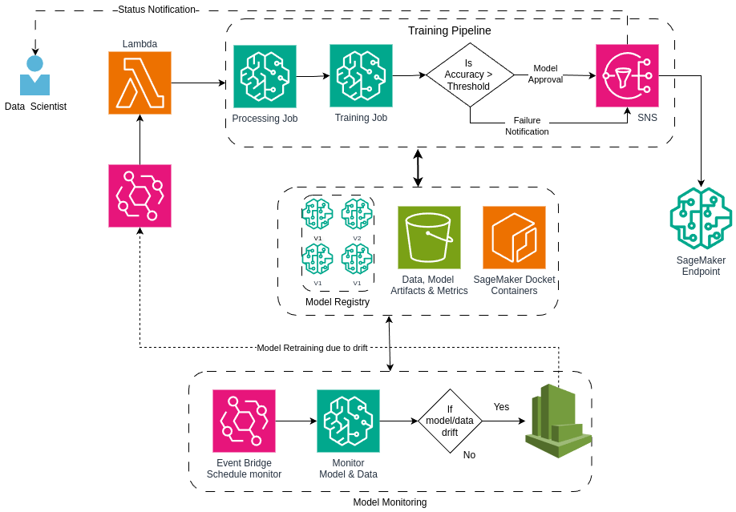

# Named Entity Recognition 

* Named-entity recognition (NER): is a problem that has a goal to locate and classify named entities mentioned in unstructured text into pre-defined categories such as person names, organizations, locations, medical codes, time expressions, etc.
Data Processing: Processing text 

* BERT (Bidirectional Encoder Representations from Transformers): is a neural network that is capable of parsing language in the same way a human does. It uses word embeddings to translate words into numbers and then back again, allowing it to understand word context and meaning.

* AWS SageMaker Training And Deployment: use Amazon SageMaker to quickly build, train, and deploy machine learning (ML) models at any scale. As a proactive measure against model degradation, you can use Amazon SageMaker Model Monitor to continuously monitor the quality of your ML models in real time.

## AWS Architecture
